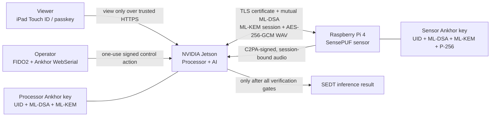
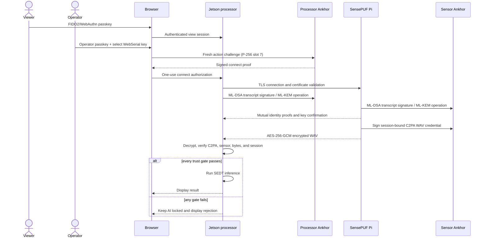

# SoundLungs presentation and generative-AI brief

Document status: exhibition handover source, 2026-08-23

Use this file as the source of truth when asking a generative AI to create
slides, posters, diagrams, animations, booth cards, narration, or bilingual
explanatory material for the SoundLungs demonstration. It describes what the
software actually does and separates standards-based functions from
demo-specific integrations.

## 1. Creative direction

### Canonical title

**SoundLungs — Connected data. Verified before AI.**

Traditional Chinese:

**SoundLungs — 資料連線後，先驗證，再進入 AI。**

### One-sentence description

SoundLungs demonstrates a Raspberry Pi respiratory-audio sensor that must prove
its hardware identity, establish a post-quantum protected session, attach
verifiable C2PA provenance, and pass every trust gate before a Jetson AI
processor will analyze its recording.

### Core message

The network connection alone is never trusted. The user, operator key, two edge
devices, session, encrypted payload, and media provenance are verified at
separate boundaries. If any required proof is absent or different, the AI gate
stays closed.

### Tone

- Clear, calm, engineered, and demonstrable.
- Explain one trust boundary at a time.
- Prefer “show the evidence” over abstract cybersecurity claims.
- Avoid fear-based hacker imagery, magic shields, and quantum-computer clichés.
- Present the system as an exhibition demonstrator, not a certified product or
  medical device.

### Visual system

- Primary accent: teal `#1F7C7F`.
- Background: soft neutral gray/lavender `#F2F1F4`.
- Panels: white `#FFFFFF` with restrained gray borders.
- Main text: charcoal `#2D2932`.
- Muted text: gray `#716B78`.
- Failure state: muted red `#9F444C`.
- Use thin left-to-right trust lines, small cryptographic evidence chips, and
  rounded rectangular stages matching the live UI.
- Show the Pi sensor on the left, a protected network path in the center, the
  NVIDIA Jetson on the right, and browser users above the Jetson.
- Do not use purple as the primary accent; the approved accent is teal.

## 2. Audience-ready explanations

### Ten-second booth line

“This sensor cannot send data to AI just because it is on the network. Hardware
identity, post-quantum keys, encrypted transport, and signed media provenance
must all verify first.”

### Thirty-second pitch

“SoundLungs is a zero-trust edge-AI demonstration. A Raspberry Pi captures a
respiratory recording and a hardware root of trust proves which sensor created
it. The Pi and NVIDIA Jetson mutually authenticate with ML-DSA-65, establish a
fresh Category 3 secret with ML-KEM-768, and encrypt the recording with
AES-256-GCM. The recording carries a C2PA Content Credential bound to that live
session. The Jetson runs inference only after the TLS identity, post-quantum
handshake, encryption, sensor identity, exact audio bytes, and provenance all
pass. Viewers enter with FIDO2 passkeys; only an enrolled Ankhor operator key can
connect or disconnect the sensor.”

### Two-minute live-demo narration

1. “The iPad uses a FIDO2/WebAuthn passkey such as Touch ID. It can see the live
   demo, but it is intentionally view-only.”
2. “A desktop operator first authenticates with a passkey, then proves possession
   of the separately enrolled Ankhor key through WebSerial. Connect and
   disconnect each require a fresh, one-use hardware signature.”
3. “The Jetson verifies the sensor’s HTTPS/TLS certificate. Being on the same
   Wi-Fi is not enough.”
4. “Both edge keys sign the complete certificate-bound handshake with
   ML-DSA-65. A pinned UID and public-key identity must match on each device.”
5. “ML-KEM-768 establishes a fresh post-quantum shared secret. A short session
   seed is protected by the hardware; bulk audio uses efficient AES-256-GCM.”
6. “The Pi signs the WAV’s C2PA Content Credential with its hardware P-256 key
   and binds it to this exact session.”
7. “The Jetson decrypts the WAV, validates the C2PA signature, authorized sensor,
   exact bytes, and session binding, then opens the AI gate.”
8. “If we remove or exchange either edge key, both products show ‘Ankhor
   Root-of-Trust absent or compromised.’ Returning the correct key restores the
   pinned identity.”

### Traditional Chinese thirty-second pitch

“SoundLungs 是一個零信任邊緣 AI 展示。Raspberry Pi 感測器先由硬體信任根證明
身分，並與 NVIDIA Jetson 使用 ML-DSA-65 相互驗證，再透過 ML-KEM-768 建立
新的第三類安全等級工作階段，錄音則以 AES-256-GCM 加密。每段 WAV 都帶有
綁定目前連線的 C2PA 內容憑證。只有當 TLS、後量子密碼、裝置身分、錄音內容
與來源證明全部通過，Jetson 才會執行 AI 推論。觀眾可用 FIDO2 通行密鑰查看，
但只有已註冊的 Ankhor 操作員金鑰能控制連線。”

## 3. Physical system and trust boundaries

### Components

| Component | Physical platform | Function | Hardware trust role |
|---|---|---|---|
| SensePUF sensor | Raspberry Pi 4 with touchscreen | Selects/signs respiratory WAV records and serves the secure stream | Edge Ankhor key: pinned UID, ML-DSA-65, ML-KEM-768, P-256 C2PA signing |
| AI processor | NVIDIA Jetson with CUDA | Receives, verifies, decrypts, provenance-gates, and classifies recordings | Edge Ankhor key: pinned UID, ML-DSA-65, ML-KEM-768, public FIDO credential mirror |
| Viewer | iPad Mini or other browser | Authenticates and watches shared live state | FIDO2/WebAuthn platform or roaming passkey; no control permission |
| Operator | Desktop Chromium/Edge | Authenticates and requests connect/disconnect | FIDO2/WebAuthn credential plus a separate bound Ankhor WebSerial P-256 key |
| Local network | Exhibition Wi-Fi/Ethernet | Carries HTTPS and sensor traffic | Treated as untrusted transport; network presence grants no authorization |

### Three distinct Ankhor roles

Do not merge these into one key in diagrams:

1. The **sensor edge key** is physically attached to the Raspberry Pi at
   `/dev/ttyACM0`.
2. The **processor edge key** is physically attached to the Jetson at
   `/dev/ttyACM0`.
3. The **browser operator key** is attached to the desktop browser and accessed
   through WebSerial. Its BYO P-256 control key uses slot 7.

The two edge keys prove service/device identity. The browser key proves authority
for a control action. FIDO2 proves browser-user authentication. These are related
layers, not interchangeable protocols.

### Architecture diagram source



### Security-control planes

| Plane | Question answered | Mechanisms in this demo |
|---|---|---|
| Human access | Who may enter the processor UI? | FIDO2/WebAuthn passkey |
| Operator authorization | Who may change connection state right now? | Viewer/operator role plus a fresh browser-connected Ankhor P-256 WebSerial proof |
| Edge identity | Are these the enrolled physical devices? | Immutable UID pinning, host binding, pinned ML-DSA/P-256 public identities |
| Transport | Is the endpoint authenticated and traffic protected in transit? | HTTPS/TLS certificate validation and application-layer authenticated encryption |
| Post-quantum session | Is the handshake signed and is the key fresh? | Mutual ML-DSA-65 transcript signatures and ML-KEM-768 shared-secret establishment |
| Media provenance | Did the authorized sensor sign these exact bytes for this session? | Embedded C2PA Content Credential with hardware P-256 signature and session binding |
| AI policy | May this recording reach inference? | Fail-closed verification gate before model execution |

## 4. What happens on screen

### Processor top flow

| UI stage | Visitor-friendly label | What is actually checked |
|---|---|---|
| 00 | FIDO2 | WebAuthn passkey authentication; viewer or operator account class |
| 01 | TLS certificate | `sensepuf.local` endpoint certificate and configured trust/pin |
| 02 | ML-DSA + ML-KEM | Mutual Category 3 transcript proof and fresh session establishment |
| 03 | AES receive | Ordered AES-256-GCM chunks for the selected WAV |
| 04 | C2PA | Signed sensor identity, exact WAV bytes, and live-session provenance |
| 05 | AI model | SEDT inference is allowed only after every previous gate passes |

### Processor live tiles

- **Sensor** — recording transmission state.
- **C2PA** — provenance credential and authorized sensor verification.
- **AES** — encrypted transfer progress and authenticated chunks.
- **AI** — gated inference result.

### Failure demonstrations

| Demonstration action | Expected visible result | Security lesson |
|---|---|---|
| Remove an edge key | Full-page “Ankhor Root-of-Trust absent or compromised” warning | Cryptographic service cannot continue without its hardware root |
| Exchange Pi and Jetson keys | Each reports the received UID does not match its enrolled UID | A valid but different key is not trusted |
| Return the correct keys | Supervised services re-verify and return to ready | Recovery does not weaken identity pinning |
| Remove the browser operator key | Sensor stream stops; all viewer and operator sessions are logged out | Loss of operator root invalidates the shared control session |
| Sign in from iPad Touch ID | Live view works; connect/disconnect remains unavailable | Authentication and authorization are separate decisions |
| Modify signed WAV bytes or provenance | C2PA validation fails; AI remains locked | AI consumes only content that passes the configured provenance policy |

## 5. Standards map and precise claims

### FIDO2 and WebAuthn

FIDO2 combines the W3C Web Authentication API with the FIDO Alliance Client to
Authenticator Protocol family. WebAuthn creates origin-scoped public-key
credentials and uses signed challenges for registration and authentication.

In SoundLungs:

- iPad Touch ID or another passkey authenticates a viewer.
- A desktop account may be registered as an Ankhor operator.
- Operator control then adds a project-specific WebSerial P-256 proof from the
  bound Ankhor key for each connect/disconnect action.
- Removing the active operator key triggers a demo-wide session revocation.

Approved description: **“FIDO2/WebAuthn passkey access with hardware-bound,
step-up operator authorization.”**

Do not claim that the project-specific WebSerial protocol is part of FIDO2, or
that the application/key is FIDO Certified unless formal certification has been
completed.

Official references:

- [FIDO Alliance specifications overview](https://fidoalliance.org/specifications/)
- [W3C Web Authentication specification family](https://www.w3.org/TR/webauthn/all/)

### C2PA Content Credentials

C2PA defines cryptographically bound provenance structures for digital assets.
The active manifest and signature can make provenance tamper-evident and bind it
to the asset bytes.

In SoundLungs:

- the Raspberry Pi embeds a C2PA Content Credential in the WAV;
- the sensor’s hardware P-256 key signs the credential;
- claims include the authorized sensor and live session context;
- the Jetson validates the signature, trust chain, asset binding, and session
  binding before inference.

Approved description: **“C2PA provenance-gated AI: the signed recording is
verified before inference.”**

Important limitation: C2PA provenance does not decide whether a recording or
claim is factually true. It provides verifiable, tamper-evident provenance from
a signer under a chosen trust policy.

Official references:

- [C2PA specification 2.4](https://spec.c2pa.org/specifications/specifications/2.4/index.html)
- [C2PA explainer](https://c2pa.org/specifications/specifications/2.2/explainer/Explainer.html)
- [C2PA guiding principles](https://c2pa.org/principles/)

### Post-quantum cryptography

NIST standardized ML-KEM in FIPS 203 and ML-DSA in FIPS 204. ML-KEM is a key
encapsulation mechanism for establishing shared secrets; ML-DSA is a digital
signature scheme. The parameter sets used here—ML-KEM-768 and ML-DSA-65—target
NIST security category 3.

In SoundLungs:

- both edge devices use ML-DSA-65 to sign the complete, domain-separated,
  certificate-bound handshake transcript;
- pinned public keys and UIDs identify the enrolled physical endpoints;
- ML-KEM-768 establishes fresh session material;
- each hardware device protects a short session seed operation;
- host AES-256-GCM handles bulk WAV data because the serial hardware interface
  is optimized for small cryptographic transactions.

Approved description: **“NIST-standardized Category 3 ML-DSA-65 authentication
and ML-KEM-768 key establishment, executed with edge hardware roots of trust.”**

Do not say “quantum-proof,” “unbreakable,” “post-quantum TLS,” or “FIPS-validated
module.” The application-layer PQC handshake runs in addition to TLS; the demo
has not claimed a formal cryptographic module validation.

Official references:

- [NIST FIPS 203: ML-KEM](https://csrc.nist.gov/pubs/fips/203/final)
- [NIST FIPS 204: ML-DSA](https://csrc.nist.gov/pubs/fips/204/final)

### Zero trust

NIST zero-trust guidance removes implicit trust based only on network location
or ownership and focuses policy on users, devices, and resources.

In SoundLungs:

- the local exhibition network grants no application permission;
- user authentication, operator authorization, edge identity, payload
  authenticity, provenance, and model admission are separate checks;
- viewer access does not grant control;
- every control action uses a fresh, action-bound challenge;
- absent/different hardware causes a fail-closed screen;
- authenticated encrypted data still cannot reach AI until provenance passes.

Approved description: **“A zero-trust design demonstration with explicit user,
device, session, content, and action verification.”**

Do not describe this small demo as a complete enterprise ZTA deployment or a
zero-trust certification.

Official reference:

- [NIST SP 800-207: Zero Trust Architecture](https://csrc.nist.gov/pubs/sp/800/207/final)

### TLS, X.509, and AES-GCM

- HTTPS/TLS supplies encrypted transport and certificate-based server identity.
  The implementation requires TLS 1.2 or later; it is not described as a
  post-quantum TLS stack.
- X.509 certificates represent the disposable demonstration trust chains used
  by the browser, TLS endpoint, and C2PA signer.
- AES-256-GCM supplies authenticated encryption for the bulk WAV stream. GCM
  protects confidentiality and produces an authentication tag over ciphertext
  and associated data.

Official references:

- [IETF RFC 8446: TLS 1.3](https://www.rfc-editor.org/info/rfc8446/)
- [IETF RFC 5280: Internet X.509 PKI profile](https://www.rfc-editor.org/info/rfc5280/)
- [NIST SP 800-38D: GCM and GMAC](https://csrc.nist.gov/pubs/sp/800/38/d/final)

## 6. End-to-end sequence



### Short label sequence for posters

**Passkey → operator proof → TLS identity → ML-DSA identity → ML-KEM session →
AES transfer → C2PA provenance → AI**

Traditional Chinese:

**通行密鑰 → 操作員證明 → TLS 身分 → ML-DSA 身分驗證 → ML-KEM 工作階段 →
AES 傳輸 → C2PA 來源證明 → AI**

## 7. Slide-deck blueprint

### Slide 1 — The question

Headline: **Should AI trust every sensor packet on the same network?**

Visual: one respiratory waveform approaching a locked AI processor, with five
small evidence gates between them.

Speaker point: Network reachability is not identity, authorization, integrity,
or provenance.

### Slide 2 — The physical demo

Headline: **Two edge devices. Three hardware trust roles. One gated AI path.**

Visual: Pi touchscreen and its key, Jetson and its key, iPad viewer, desktop
operator with a third key. Use physical cables and simple labels.

Speaker point: Keep the two edge keys visually separate from the browser
operator key.

### Slide 3 — Authenticate the humans and actions

Headline: **Passkey to view. Hardware proof to control.**

Visual: split viewer/operator card. Viewer has an eye icon; operator has an eye
plus a signed connect/disconnect switch.

Speaker point: FIDO2 authenticates; application policy authorizes. WebSerial
action proof is an additional project layer.

### Slide 4 — Authenticate the endpoints and establish a session

Headline: **Category 3 identity and key establishment at the edge.**

Visual: two hardware keys exchanging an ML-DSA-signed transcript and ML-KEM
capsule, producing one short-lived session key.

Speaker point: ML-DSA-65 and ML-KEM-768 are NIST-standardized algorithms. Avoid
claiming PQC is inside TLS.

### Slide 5 — Trust the recording, not just the channel

Headline: **C2PA provenance travels with the WAV.**

Visual: a waveform inside a signed Content Credential envelope, with sensor UID,
session ID, byte binding, and P-256 signature as four evidence chips.

Speaker point: Encryption protects transport; C2PA enables provenance validation
after decryption.

### Slide 6 — Gate the model

Headline: **No verified provenance, no inference.**

Visual: three fixed-size live tiles—encrypted receive, provenance verification,
and AI—where the AI tile unlocks last.

Speaker point: This is the policy outcome visitors can see, not just background
cryptography.

### Slide 7 — Demonstrate failure safely

Headline: **A valid different key is still the wrong key.**

Visual: green enrolled UID becomes red mismatched UID; full-screen compromised
state appears on both devices.

Speaker point: Swapping the two working edge keys was tested: both services
rejected the other valid key and recovered after the correct keys returned.

### Slide 8 — Summary

Headline: **User. Device. Session. Content. Action. Verify each boundary.**

Visual: five teal checks feeding a final AI result, with a red fail-closed path
under each check.

Speaker point: Standards are combined into one observable zero-trust workflow.

## 8. Generative visual prompt pack

### Master style prefix

Use this before any prompt:

> Create a clean enterprise edge-AI security infographic for an exhibition.
> White and very light gray-lavender background, teal #1F7C7F primary accent,
> charcoal typography, thin technical connector lines, restrained muted-red
> failure state, rounded cards, generous whitespace, precise hardware shapes,
> flat vector style with subtle depth. No neon, no hooded hackers, no fantasy
> quantum imagery, no decorative padlock overload, no medical diagnosis claims.

### Prompt A — 16:9 architecture overview

> Show a Raspberry Pi 4 respiratory-audio sensor with touchscreen on the left,
> its USB hardware root-of-trust directly below it, an NVIDIA Jetson AI processor
> on the right with a second USB hardware root, an iPad viewer above using Touch
> ID/passkey, and a desktop operator using FIDO2 plus a third WebSerial hardware
> key. Between Pi and Jetson show ordered gates labeled TLS, ML-DSA-65,
> ML-KEM-768, AES-256-GCM, C2PA, then AI. Make arrows unidirectional where
> appropriate and show AI locked until C2PA is green. Use accurate concise labels
> and keep all text large enough for a booth screen.

### Prompt B — Vertical poster

> Design an A1 portrait poster titled “Connected data. Verified before AI.” Top:
> physical Pi-to-Jetson system. Middle: eight-step vertical trust flow—Passkey,
> Operator proof, TLS, ML-DSA, ML-KEM, AES, C2PA, AI. Bottom: three failure
> examples—missing key, different valid key, tampered recording—with the common
> result “AI stays locked.” Include a small standards strip for FIDO2/WebAuthn,
> NIST FIPS 203/204 algorithms, C2PA Content Credentials, TLS, and AES-GCM. Do not
> use certification seals or official logos.

### Prompt C — C2PA explainer

> Create a four-panel diagram: 1) sensor selects WAV, 2) hardware P-256 key signs
> a C2PA Content Credential containing sensor and session context, 3) encrypted
> WAV crosses an untrusted network, 4) Jetson decrypts and validates signer,
> exact bytes, trust chain, and session binding before unlocking AI. Add a clear
> footer: “Provenance is verifiable evidence, not a judgment that content is
> factually true.”

### Prompt D — Viewer versus operator

> Create two balanced role cards. Viewer: iPad, Touch ID/passkey, live telemetry,
> view-only badge. Operator: desktop Chrome/Edge, passkey, selected Ankhor
> WebSerial key, fresh one-use P-256 signature for Connect or Disconnect. Center
> rule: “Authentication does not automatically grant control.”

### Prompt E — Key-removal animation storyboard

> Produce six simple frames: all systems verified; operator removes the browser
> key; stream stops; all browser accounts return to login; operator reinserts and
> signs in again; trusted operation resumes. In a second row show edge-key swap:
> Pi expects UID A but receives UID B, Jetson expects UID B but receives UID A,
> both display a full red compromised screen, then recover only when original
> keys return. Do not show a key touch because normal verification does not
> require touch.

### Prompt F — Minimal standards cards

> Make five compact cards with one verb each: FIDO2 “Authenticate,” ML-DSA
> “Sign identity,” ML-KEM “Establish secret,” AES-GCM “Encrypt and authenticate,”
> C2PA “Prove provenance.” Add a sixth card, Zero Trust “Verify every boundary.”
> Keep terminology exact and do not imply certification.

## 9. Copy library

### Booth headline options

- Connected data. Verified before AI.
- A secure channel is only the beginning.
- No provenance, no inference.
- A valid key is not enough. It must be the enrolled key.
- Passkey to view. Hardware proof to control.
- Post-quantum trust from sensor to AI.

### Traditional Chinese headline options

- 資料連線後，先驗證，再進入 AI。
- 安全通道，只是信任的第一步。
- 沒有來源證明，就不進行 AI 推論。
- 有效金鑰還不夠，必須是已註冊的金鑰。
- 通行密鑰可查看，硬體證明才能控制。
- 從感測器到 AI 的後量子信任鏈。

### One-line labels

| English | Traditional Chinese |
|---|---|
| Viewer access | 檢視者存取 |
| Operator control | 操作員控制 |
| Hardware root of trust | 硬體信任根 |
| Endpoint identity | 端點身分 |
| Post-quantum signature | 後量子數位簽章 |
| Key establishment | 金鑰建立 |
| Authenticated encryption | 認證加密 |
| Content provenance | 內容來源證明 |
| Model gate | 模型閘門 |
| Root of trust absent or compromised | 信任根不存在或可能遭到破壞 |
| Different enrolled key | 與已註冊金鑰不符 |
| AI remains locked | AI 維持鎖定 |

### Three facts for a small booth card

1. **FIDO2 separates access roles.** Passkey viewers can observe; hardware-bound
   operators can control.
2. **PQC protects edge-session establishment.** ML-DSA-65 authenticates the
   transcript and ML-KEM-768 creates fresh Category 3 session material.
3. **C2PA gates AI.** The exact signed WAV and its session-bound provenance must
   validate before inference.

## 10. Frequently asked questions

### Is C2PA an encryption format?

No. C2PA provides cryptographically bound provenance. AES-256-GCM encrypts and
authenticates the WAV during transport in this demo.

### Does C2PA prove that the medical content is true?

No. It proves configured provenance evidence and tamper binding under a trust
policy. It does not establish factual or clinical truth.

### Is FIDO2 doing the post-quantum handshake?

No. FIDO2/WebAuthn authenticates browser users. ML-DSA and ML-KEM protect the
edge-device application session. The browser Ankhor WebSerial action proof is a
third, project-specific authorization layer.

### Why use TLS if the application also uses PQC and AES?

TLS authenticates the network endpoint and protects the connection. The
application adds pinned hardware identities, post-quantum transcript proof,
fresh key establishment, and record-specific policy. The controls have distinct
jobs.

### Why is bulk encryption not performed entirely inside the USB key?

The device interface handles small cryptographic transactions. The demo keeps
session-seed protection in hardware and uses host AES-256-GCM for efficient WAV
streaming.

### What happens if a different but valid key is inserted?

Its immutable UID and public identity do not match the manifest, so the service
enters the compromised state. This behavior was tested by exchanging the working
Pi and Jetson keys.

### Is this a medical device or diagnostic product?

No. It is an engineering exhibition demo using respiratory-audio classification
to make the secure data path visible. Do not make clinical performance or
diagnostic claims.

## 11. Claim-control guide

### Approved claims

- Uses NIST-standardized ML-KEM-768 and ML-DSA-65 algorithms at Category 3
  parameter sets.
- Uses FIDO2/WebAuthn passkeys for browser authentication.
- Uses C2PA Content Credentials to provide tamper-evident recording provenance.
- Uses AES-256-GCM authenticated encryption for bulk audio.
- Uses hardware-bound private operations and pinned edge identities.
- Applies zero-trust principles by explicitly verifying users, devices, actions,
  sessions, and content before AI.
- Fails closed when required hardware or provenance is absent or different.

### Claims to avoid

- “FIPS certified,” “FIPS validated,” or “FIDO Certified.”
- “Quantum-proof,” “unhackable,” or “impossible to forge.”
- “PQC is integrated into TLS” or “post-quantum TLS.”
- “C2PA proves the recording is true.”
- “FIDO2 alone authorizes connect/disconnect.”
- “All encryption occurs in hardware.”
- “Complete enterprise zero-trust architecture.”
- Any diagnostic accuracy, patient-safety, or medical-device claim.

## 12. Machine-readable fact sheet

```yaml
project:
  name: SoundLungs
  tagline: Connected data. Verified before AI.
  type: engineering exhibition demonstrator
  medical_device: false
visual_identity:
  primary: "#1F7C7F"
  danger: "#9F444C"
  background: "#F2F1F4"
hardware:
  sensor: Raspberry Pi 4
  processor: NVIDIA Jetson with CUDA
  edge_roots: 2 Ankhor USB devices
  operator_root: separate browser-connected Ankhor USB device
access:
  viewer: FIDO2/WebAuthn passkey, view only
  operator: FIDO2/WebAuthn plus per-action WebSerial P-256 proof
security_flow:
  - HTTPS/TLS certificate validation
  - pinned edge UID and public identities
  - mutual ML-DSA-65 handshake signatures
  - ML-KEM-768 shared-secret establishment
  - hardware-protected short session seed
  - host AES-256-GCM bulk WAV transport
  - hardware P-256 C2PA WAV signature
  - C2PA signer, bytes, and session verification
  - AI inference gate
failure_policy: fail closed and display root-of-trust/provenance warning
standards:
  - FIDO2 and W3C WebAuthn
  - NIST FIPS 203 algorithm ML-KEM-768
  - NIST FIPS 204 algorithm ML-DSA-65
  - C2PA Content Credentials
  - TLS and X.509
  - NIST AES-GCM
  - NIST SP 800-207 zero-trust principles
non_claims:
  - no formal FIDO or FIPS certification claim
  - no post-quantum TLS claim
  - no factual-truth claim from C2PA
  - no medical or diagnostic claim
```

## 13. Instructions for a generative AI

When generating material from this brief:

1. Preserve the order and separation of the trust boundaries.
2. Show three distinct hardware-key roles, not one generic key.
3. Make the AI stage visibly last and locked until C2PA succeeds.
4. Describe ML-DSA-65 and ML-KEM-768 as NIST-standardized Category 3 algorithm
   parameter sets, not certified products.
5. Describe FIDO2/WebAuthn as user authentication and the WebSerial signature as
   additional application-specific operator authorization.
6. Describe C2PA as verifiable provenance, not proof of factual truth.
7. State that bulk WAV encryption is host AES-256-GCM with short session-seed
   protection performed through the hardware roots.
8. Use the teal visual system and do not introduce unrelated product names.
9. Do not invent cloud services, blockchain, patient data, biometric databases,
   or Internet connectivity. The demo runs on a local exhibition network.
10. End with the observable policy: **if any required proof fails, AI remains
    locked.**

## 14. Supporting project documents

- `README.md` — repository architecture and launch overview.
- `docs/HANDOVER.md` — full setup, certificate trust, key enrollment, Wi-Fi,
  recovery, and exhibition operation.
- `processor/templates/dashboard.html` — exact processor flow and tile labels.
- `processor/static/i18n.js` — approved English and Traditional Chinese UI text.
- `common/protocol.py` — exact protocol algorithm names and message framing.

Before publishing material, compare technical text against the current Git
commit and the live UI. This brief explains the checked-in exhibition build; a
future key/module or protocol revision must update both the implementation and
this document.
